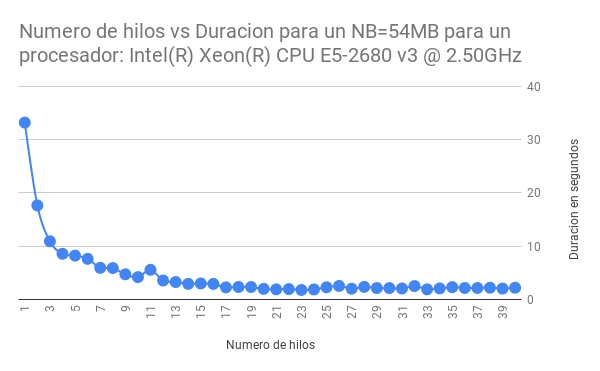
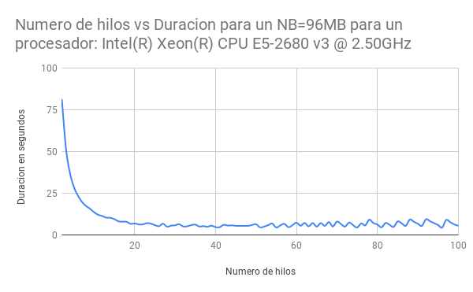

# curso-hcp-igp

## Clase 1

Ejemplos de introduccion a C, salida y entrada estandar (libreria stdio.h).

## Clase 2

Ejemplos de funciones, punteros y asignacion dinamica de memoria (libreria stdlib.h).

## Clase 3

Ejemplos de estructuras, hilos, barreras y herramienta gprof (libreria pthread.h).

## Clase 4

Ejemplos de sincronizacion con exclusion mutua, uniendo hilos, midiendo el tiempo de ejecucion, comparando programa serial vs paralelo y barreras (libreria pthread.h).

## Clase 5

Ejemplos de corrimiento de bits, principios de localidad espacial y temporal, orden por filas y asignacion continua de direcciones de memoria. (libreria time.h)

## Clase 6

Introduccion a fortran 95, ejemplos de salida y entrada estandar, numeros, bloques program, lazos do, condicionales if-else y funciones (paso por valor).

## Clase 7

Ejemplos de subrutinas (paso por referencia), bloques de modulos, alias de subrutinas, arreglos estaticos, arreglos dinamicos, arreglos de primer orden y segundo orden, numeros aleaorios con semilla, formato para numeros y cadenas de caracteres, estructuras de datos (type) y arreglo de estructuras (type).

## Clase 8

Ejemplos de MPI con fortran 95, iniciar MPI con MPI_INIT, identificar el id del proceso (rankid) con MPI_COMM_RANK, obtener el numero de procesos con MPI_COMM_SIZE, enviar mensajes con MPI_SEND, recibir mensajes con MPI_RECV por el comunicador MPI_COMM_WORLD y terminar el proceso con MPI_COMM_FINALIZE. Paso de mensajes tipo datos enteros y arreglos.

## Clase 9

Ejemplos de MPI con fortran 95, para enviar y recibir enteros y arreglos usando MPI_SEND y MPI_RECV.

## Clase 10

Ejemplos de MPI con fortran 95, enviando y recibiendo datos usando broadcast MPI_BCAST y barreras MPI_BARRIER, partiendo datos usando scatter MPI_SCATTER, componiendo datos usando MPI_GATHER y usando operaciones de reduccion MPI_REDUCE.

## Laboratorio 1

* Programar una calculador con menu con c
* Programa multiplicación de matrices cuadras con c

## Laboratorio 2

* Programar paralelizar la operacion de multiplicación de matrices, utilizando hilos con librería pthread

* Gráfica de la multiplicación de matrices paralelo nodo master

* Gráfica de la multiplicación de matrices paralelo nodo computo

## Laboratorio 3

* Programar una calculador con menu con fortran 95
* Programa multiplicación de matrices cuadras con fortran 95

## Laboratorio 4

* Programa en Fortran para la multiplicacion de dos matrices, utilizando MPI

* Gráfica de la multiplicación de matrices en sequencial y en paralelo usando MPI, sobre el de nodo computo

* Gráfica de la multiplicación de matrices en paralelo usando MPI, desde 1 hasta 12 CPUs

* Gráfica de la multiplicación de matrices en paralelo usando MPI, desde 13 hasta 24 CPUs

* Gráfica de la multiplicación de matrices en paralelo usando MPI, desde 25 hasta 36 CPUs

* Gráfica de la multiplicación de matrices en paralelo usando MPI, desde 37 hasta 48 CPUs

## Laboratorio 5

* Fortran funciones MPI (gatherm, scatter, reduce) tiempo

## Laboratorio 6

* Fortran HDF5 Guardar la salida

## Laboratorio 7

* Fortran a C

